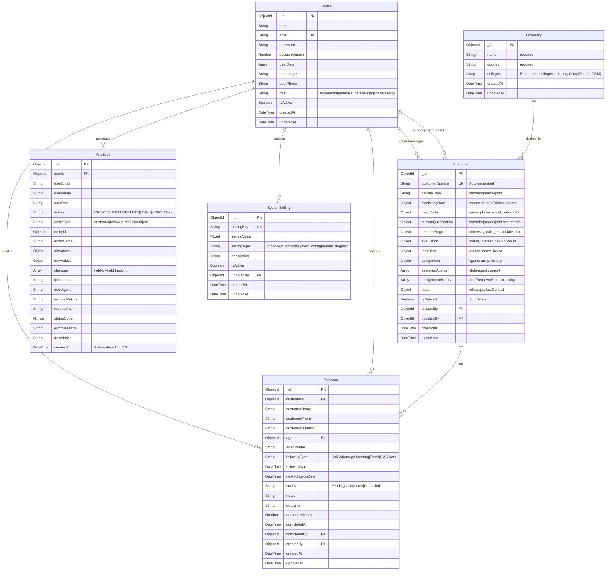

# Complete Entity-Relationship (ER) Diagram
## Egec CRM System Database Architecture

---

## 📊 Full ER Diagram



---

## 🔗 Relationship Details

### 1. **Profile ↔ Customer** (One-to-Many + Multi-Agent)
- **Type**: One Profile can create/manage many Customers
- **Type**: Multiple Profiles can be assigned to one Customer (Multi-Agent Support)
- **Fields**:
  - `Customer.createdBy` → `Profile._id`
  - `Customer.updatedBy` → `Profile._id`
  - `Customer.assignment.assignedAgentId` → `Profile._id` (primary agent)
  - `Customer.assignment.assignedAgents[].agentId` → `Profile._id` (multi-agent)
  - `Customer.marketingData.counselorId` → `Profile._id`
  - `Customer.marketingData.subGuide1Id|2Id|3Id` → `Profile._id`
  - `Customer.assignment.assignedBy` → `Profile._id`
  - `Customer.lossData.lostBy` → `Profile._id`

### 2. **Profile ↔ Followup** (One-to-Many)
- **Type**: One Profile can create/handle many Followups
- **Fields**:
  - `Followup.agentId` → `Profile._id` (responsible agent)
  - `Followup.createdBy` → `Profile._id`
  - `Followup.completedBy` → `Profile._id`

### 3. **Customer ↔ Followup** (One-to-Many)
- **Type**: One Customer can have many Followups
- **Fields**:
  - `Followup.customerId` → `Customer._id`
- **Cascade**: When customer is soft-deleted, followups remain (historical record)

### 4. **Profile ↔ AuditLog** (One-to-Many)
- **Type**: One Profile generates many AuditLogs
- **Fields**:
  - `AuditLog.userId` → `Profile._id`
- **Note**: Authentication events (LOGIN, LOGOUT) are also logged

### 5. **Profile ↔ SystemSetting** (One-to-Many)
- **Type**: One Profile can update many SystemSettings
- **Fields**:
  - `SystemSetting.updatedBy` → `Profile._id`

### 6. **University ↔ Customer** (One-to-Many - Reference)
- **Type**: One University can be desired by many Customers
- **Fields**:
  - `Customer.desiredProgram.desiredUniversityId` → `University._id`
- **Note**: This is a soft reference (not enforced FK)

---

## 📈 Key Features

### **Multi-Agent Support (Customer Assignment)**
```
Customer.assignment.assignedAgents = [
  {
    agentId: ObjectId (Profile),
    agentName: String,
    assignedAt: Date,
    assignedBy: ObjectId (Profile),
    counselorStatus: String (independent per agent),
    isActive: Boolean (can remove access without deleting)
  }
]
```

### **Assignment History Tracking**
```
Customer.assignment.assignmentHistory = [
  {
    action: "assigned" | "removed" | "status_updated",
    agentId: ObjectId (Profile),
    performedBy: ObjectId (Profile),
    performedAt: Date,
    reason: String,
    previousCounselorStatus: String,
    newCounselorStatus: String
  }
]
```

### **Audit Trail (Complete System)**
- Tracks: CREATE, UPDATE, DELETE, LOGIN, LOGOUT, LOGIN_FAILED, ASSIGN, etc.
- Records: Field-level changes, IP addresses, user agents, timestamps
- Retention: Configurable TTL (Time-To-Live) for auto-deletion
- Access: Superadmin only

### **Soft Delete Pattern**
- **Customer**: `isDeleted` flag (retains all data for audit)
- **Profile**: `isActive` flag
- **SystemSetting**: `isActive` flag

---

## 🔍 Indexing Strategy

### **Customer Model** (17 Indexes)
- Primary: `_id`, `customerNumber` (unique)
- Search: Text index on name, email, phone
- Query Performance: `assignedAgentId`, `degreeType`, `salesStatus`, `isDeleted`
- Compound: `(assignedAgentId + degreeType)`, `(isDeleted + createdAt)`
- Unique Constraint: `(phone + email)` when not deleted

### **Followup Model** (6 Indexes)
- Primary: `_id`
- Foreign Keys: `customerId`, `agentId`
- Query Performance: `status`, `followupDate`
- Compound: `(agentId + status + followupDate)`, `(customerId + createdAt)`

### **AuditLog Model** (7 Indexes)
- Primary: `_id`
- Foreign Keys: `userId`
- Query Performance: `action`, `entityType`, `createdAt`
- Text Search: `userEmail`, `userName`, `action`, `entityType`, `entityName`
- TTL: Optional auto-deletion after 2 years

### **University Model** (13 Indexes)
- Primary: `_id`
- Query Performance: `name`, `country`, `universityType`, `status`
- Compound: `(country + universityType)`, `(accreditation + status)`
- Text Search: `name`

### **Profile Model**
- Primary: `_id`
- Unique: `email`

### **SystemSetting Model**
- Primary: `_id`
- Unique: `settingKey`

---

## 📊 Data Flow Summary

### **Customer Lifecycle:**
```
1. Profile (Agent/Admin) creates Customer
   ↓
2. Customer assigned to Profile (Agent) - can have multiple agents
   ↓
3. Agent creates Followups for Customer
   ↓
4. Customer evaluation updated (interest, status, next followup)
   ↓
5. Customer can be reassigned (adds new agent, preserves old agent access)
   ↓
6. Customer can be marked as Lost (soft delete) with reason
   ↓
7. All actions logged in AuditLog
```

### **Multi-Agent Workflow:**
```
Customer → Assigned to Agent A
         → Admin adds Agent B (both can access)
         → Each agent has independent counselorStatus
         → Assignment history tracks all changes
         → Admin/Superadmin can see all agents
         → Regular agents only see their own assignments
```

### **Authentication & Audit:**
```
User Login → AuditLog (LOGIN action)
         → Profile.sessionVersion incremented
         → Session created
         
User Logout → AuditLog (LOGOUT action)
         
Failed Login → AuditLog (LOGIN_FAILED action)
```

---

## 🎯 Entity Statistics

| Entity | Estimated Size/Record | Indexes | Relationships |
|--------|----------------------|---------|---------------|
| **Profile** | ~500 bytes | 2 | 5 outgoing |
| **Customer** | ~5-10 KB | 17 | 3 outgoing, 1 incoming |
| **Followup** | ~1-2 KB | 6 | 2 outgoing |
| **University** | ~1-5 KB (simplified) | 3 | 1 outgoing |
| **AuditLog** | ~1-2 KB | 7 | 1 outgoing |
| **SystemSetting** | ~200 bytes | 2 | 1 outgoing |

---

## 🔐 Access Control Matrix

| Entity | Superadmin | Admin | Superagent | Agent |
|--------|-----------|-------|------------|-------|
| **Profile** | Full CRUD | View all, Edit non-admin | View team | View self |
| **Customer** | Full CRUD | Full CRUD | Full CRUD | View/Edit assigned only |
| **Followup** | View all | View all | View team | View/Create own |
| **University** | View all | View all | View all | View all |
| **AuditLog** | View all | ❌ | ❌ | ❌ |
| **SystemSetting** | Full CRUD | ❌ | ❌ | ❌ |

---

## 📝 Notes

1. **ObjectId References**: All relationships use MongoDB ObjectId (not enforced FK)
2. **Embedded Documents**: University has embedded colleges (simplified - just names, no separate collection)
3. **Soft Deletes**: Customer uses `isDeleted` flag to preserve audit trail
4. **Multi-Agent**: Customer can be assigned to multiple agents simultaneously
5. **Independent Tracking**: Each agent has their own `counselorStatus` for the same customer
6. **Assignment History**: Full audit trail of agent additions/removals/status changes
7. **Cascading**: No automatic cascading deletes (manual cleanup required)
8. **Timestamps**: All entities have `createdAt` and `updatedAt` (except AuditLog - create only)
9. **Virtuals**: Customer and Followup have virtual fields (not stored in DB)
10. **Text Search**: Customer, University, and AuditLog support full-text search

---

## 🚀 Performance Optimizations

1. **Pagination**: All list queries use pagination (default 50 records)
2. **Lean Queries**: Read-only operations use `.lean()` for 5x speed improvement
3. **Index Coverage**: Compound indexes cover common query patterns
4. **Connection Pooling**: MongoDB connection reused across requests
5. **Caching**: Redis/In-memory cache for frequently accessed data
6. **Rate Limiting**: API endpoints protected (50 requests/minute for audit logs)
7. **TTL Indexes**: Optional auto-deletion of old audit logs (2 years)
8. **Text Indexes**: Full-text search optimized with dedicated indexes

---

**Generated**: January 9, 2026  
**Database**: MongoDB (Mongoose ODM)  
**Total Collections**: 6 (simplified for CRM)  
**Total Relationships**: 6 primary + 4 secondary  
**Architecture Pattern**: Document-based with soft references
