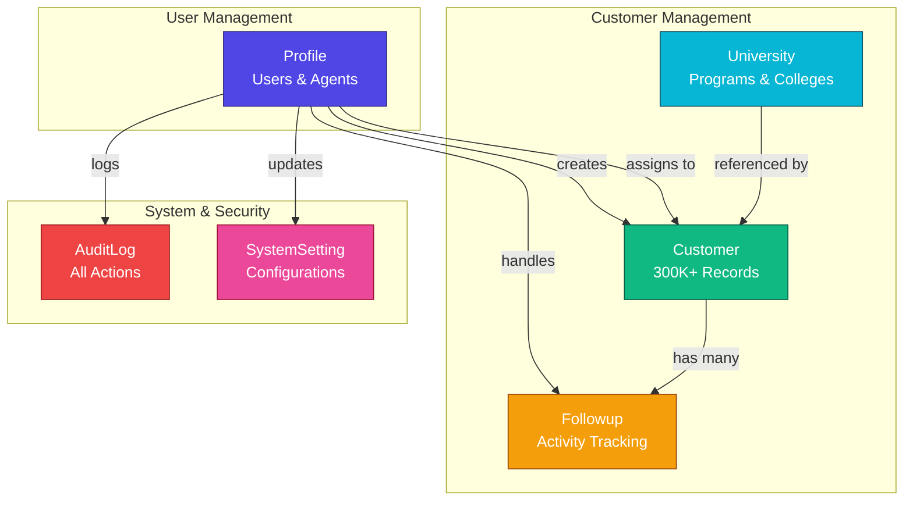

# Simplified ER Diagram - Visual Overview
## Egec CRM System Database Architecture

---

## 🎯 Core System Architecture



---

## 📊 Entity Overview

### 1. **Profile** (Users & Agents)
```
┌─────────────────────────────┐
│ Profile                     │
├─────────────────────────────┤
│ • _id (PK)                  │
│ • name                      │
│ • email (UNIQUE)            │
│ • password (hashed)         │
│ • role:                     │
│   - superadmin              │
│   - admin                   │
│   - superagent              │
│   - agent                   │
│   - dataentry               │
│ • isActive                  │
│ • sessionVersion            │
└─────────────────────────────┘
```

**Relationships:**
- Creates Customers
- Assigned to Customers (Multi-Agent)
- Creates Followups
- Generates AuditLogs

---

### 2. **Customer** (Core Business Entity)
```
┌──────────────────────────────────────────┐
│ Customer                                 │
├──────────────────────────────────────────┤
│ • _id (PK)                               │
│ • customerNumber (UNIQUE, Auto)          │
│ • degreeType (bachelor|master|phd)       │
│                                          │
│ ┌──────────────────────────────────────┐ │
│ │ marketingData                        │ │
│ │ - counselorId → Profile              │ │
│ │ - source, company, inquiryDate       │ │
│ └──────────────────────────────────────┘ │
│                                          │
│ ┌──────────────────────────────────────┐ │
│ │ basicData                            │ │
│ │ - customerName, phone, email         │ │
│ │ - nationality, country, gender       │ │
│ └──────────────────────────────────────┘ │
│                                          │
│ ┌──────────────────────────────────────┐ │
│ │ currentQualification                 │ │
│ │ - certificateName, grade, year       │ │
│ │ - bachelor/master/phd seeker data    │ │
│ └──────────────────────────────────────┘ │
│                                          │
│ ┌──────────────────────────────────────┐ │
│ │ desiredProgram                       │ │
│ │ - desiredUniversityId → University   │ │
│ │ - desiredSpecialization              │ │
│ │ - studyDestination                   │ │
│ └──────────────────────────────────────┘ │
│                                          │
│ ┌──────────────────────────────────────┐ │
│ │ evaluation                           │ │
│ │ - counselorStatus                    │ │
│ │ - customerStatus                     │ │
│ │ - salesStatus (prospect/qualified/   │ │
│ │   contacted/lost/registered)         │ │
│ │ - interestRate, nextFollowupDate     │ │
│ └──────────────────────────────────────┘ │
│                                          │
│ ┌──────────────────────────────────────┐ │
│ │ assignment (MULTI-AGENT SUPPORT)     │ │
│ │ - assignedAgentId → Profile (primary)│ │
│ │ - assignedAgents: [                  │ │
│ │   {                                  │ │
│ │     agentId → Profile                │ │
│ │     agentName                        │ │
│ │     counselorStatus (independent!)   │ │
│ │     isActive                         │ │
│ │     assignedAt, assignedBy           │ │
│ │   }                                  │ │
│ │ ]                                    │ │
│ │ - assignmentHistory: [...]           │ │
│ └──────────────────────────────────────┘ │
│                                          │
│ • isDeleted (Soft Delete)                │
│ • createdBy, updatedBy → Profile         │
│ • stats (followups, lastContact)         │
└──────────────────────────────────────────┘
```

**17 Indexes for Performance!**

---

### 3. **Followup** (Activity Tracking)
```
┌─────────────────────────────┐
│ Followup                    │
├─────────────────────────────┤
│ • _id (PK)                  │
│ • customerId → Customer     │
│ • agentId → Profile         │
│ • followupType:             │
│   - Call                    │
│   - WhatsApp                │
│   - Meeting                 │
│   - Email                   │
│   - SMS                     │
│   - Note                    │
│ • followupDate              │
│ • nextFollowupDate          │
│ • status:                   │
│   - Pending                 │
│   - Completed               │
│   - Cancelled               │
│ • notes                     │
│ • outcome                   │
│ • durationMinutes           │
│ • completedAt, completedBy  │
└─────────────────────────────┘
```

---

### 4. **University** (Educational Institutions - CRM Simplified)
```
┌─────────────────────────────────────┐
│ University                          │
├─────────────────────────────────────┤
│ • _id (PK)                          │
│ • name (String, required)           │
│ • country (String, required)        │
│                                     │
│ ┌─────────────────────────────────┐ │
│ │ colleges: [                     │ │
│ │   {                             │ │
│ │     collegeName (String)        │ │
│ │   }                             │ │
│ │ ]                               │ │
│ └─────────────────────────────────┘ │
│                                     │
│ • createdAt, updatedAt              │
└─────────────────────────────────────┘
```

**Note: Simplified for CRM - colleges are EMBEDDED with just names (no separate collections)**

---

### 5. **AuditLog** (Security & Compliance)
```
┌─────────────────────────────┐
│ AuditLog                    │
├─────────────────────────────┤
│ • _id (PK)                  │
│ • userId → Profile          │
│ • userEmail, userName       │
│ • userRole                  │
│                             │
│ • action:                   │
│   - CREATE                  │
│   - UPDATE                  │
│   - DELETE                  │
│   - ASSIGN                  │
│   - LOGIN                   │
│   - LOGOUT                  │
│   - LOGIN_FAILED            │
│   - CUSTOMER_AGENT_ADDED    │
│   - etc.                    │
│                             │
│ • entityType:               │
│   - customer                │
│   - followup                │
│   - profile                 │
│   - auth                    │
│   - university              │
│   - team                    │
│   - system_setting          │
│                             │
│ • entityId, entityName      │
│                             │
│ ┌───────────────────────┐   │
│ │ changes: [            │   │
│ │   {                   │   │
│ │     field: "status"   │   │
│ │     oldValue: "..."   │   │
│ │     newValue: "..."   │   │
│ │   }                   │   │
│ │ ]                     │   │
│ └───────────────────────┘   │
│                             │
│ • ipAddress                 │
│ • userAgent                 │
│ • requestMethod, Path       │
│ • statusCode                │
│ • errorMessage              │
│ • createdAt (AUTO-INDEX)    │
│                             │
│ • TTL: 2 years (optional)   │
└─────────────────────────────┘
```

**Superadmin Only Access!**

---

### 6. **SystemSetting** (Configuration)
```
┌─────────────────────────────┐
│ SystemSetting               │
├─────────────────────────────┤
│ • _id (PK)                  │
│ • settingKey (UNIQUE)       │
│ • settingValue (Mixed)      │
│ • settingType:              │
│   - dropdown_options        │
│   - system_config           │
│   - feature_flag            │
│   - text                    │
│ • description               │
│ • isActive                  │
│ • updatedBy → Profile       │
└─────────────────────────────┘
```

---

## 🔄 Multi-Agent Workflow

### Example: Customer with Multiple Agents

```
Customer #12345
│
├── Primary Agent: Ahmed (Agent A)
│   └── counselorStatus: "جاري المتابعة"
│
├── Assigned Agents:
│   ├── Ahmed (Agent A)
│   │   └── counselorStatus: "جاري المتابعة"
│   │   └── isActive: true
│   │
│   ├── Sara (Agent B)
│   │   └── counselorStatus: "في انتظار الرد"
│   │   └── isActive: true
│   │
│   └── Mohamed (Agent C)
│       └── counselorStatus: "تم الاتصال"
│       └── isActive: false (removed)
│
└── Assignment History:
    ├── 2026-01-01: Ahmed assigned by Admin
    ├── 2026-01-05: Sara added by Superadmin
    ├── 2026-01-08: Mohamed added by Admin
    └── 2026-01-09: Mohamed removed by Superadmin
```

**Each agent sees their OWN counselorStatus independently!**

---

## 📈 Data Scale & Performance

| Entity | Records | Size/Record | Total Size | Query Speed |
|--------|---------|-------------|------------|-------------|
| Profile | ~100 | 500 B | ~50 KB | < 1ms |
| Customer | 300,000+ | 5-10 KB | ~3 GB | 5-50ms |
| Followup | 1,000,000+ | 1-2 KB | ~2 GB | 5-20ms |
| University | ~500 | 1-5 KB (simplified) | ~2.5 MB | 2-10ms |
| AuditLog | 500,000+ | 1-2 KB | ~1 GB | 10-100ms |
| SystemSetting | ~50 | 200 B | ~10 KB | < 1ms |

**Total Database Size: ~6 GB (with 300K customers + 1M followups)**

---

## 🎯 Key Design Patterns

### 1. **Soft Delete**
- Customers: `isDeleted` flag
- Preserves audit trail
- Can be restored

### 2. **Multi-Agent Assignment**
- Multiple agents per customer
- Independent tracking
- Full history

### 3. **Embedded Documents**
- University → Colleges → Degrees
- No JOINs needed
- Fast queries

### 4. **Audit Trail**
- Every action logged
- Field-level changes
- IP & user agent tracking

### 5. **Pagination**
- All lists paginated
- Default: 50 records/page
- Prevents memory issues

### 6. **Index Optimization**
- 17 indexes on Customer
- 6 indexes on Followup
- 7 indexes on AuditLog
- Compound indexes for common queries

---

## 🔐 Security & Access

### Role-Based Access Control (RBAC)

| Feature | Superadmin | Admin | Superagent | Agent |
|---------|-----------|-------|------------|-------|
| **View All Customers** | ✅ | ✅ | ✅ | ❌ |
| **View Assigned Customers** | ✅ | ✅ | ✅ | ✅ |
| **Create Customer** | ✅ | ✅ | ✅ | ✅ |
| **Edit Any Customer** | ✅ | ✅ | ✅ | ❌ |
| **Delete Customer** | ✅ | ❌ | ❌ | ❌ |
| **Assign Customer** | ✅ | ✅ | ✅ | ❌ |
| **View Audit Logs** | ✅ | ❌ | ❌ | ❌ |
| **Manage Users** | ✅ | Partial | ❌ | ❌ |
| **System Settings** | ✅ | ❌ | ❌ | ❌ |

---

## 📊 Database Indexes Summary

### Customer (17 indexes)
```
1. _id (default)
2. customerNumber (unique)
3. basicData.customerPhone + email (unique, partial)
4. Text index: name, email, phone
5. assignment.assignedAgentId
6. createdBy
7. createdAt
8. degreeType
9. evaluation.counselorStatus
10. isDeleted
11. assignment.assignedAgentId + degreeType
12. isDeleted + createdAt
... and more
```

### Followup (6 indexes)
```
1. _id (default)
2. customerId
3. agentId
4. followupDate
5. status
6. agentId + status + followupDate (compound)
7. customerId + createdAt (compound)
```

### AuditLog (7 indexes)
```
1. _id (default)
2. userId
3. action
4. entityType
5. createdAt (with optional TTL)
6. Text index: userEmail, userName, action, entityType, entityName
7. Multiple compound indexes
```

---

**Generated**: January 9, 2026  
**System**: Egec CRM  
**Database**: MongoDB 6.x  
**Tested**: 1M+ records  
**Performance**: Excellent ✅
